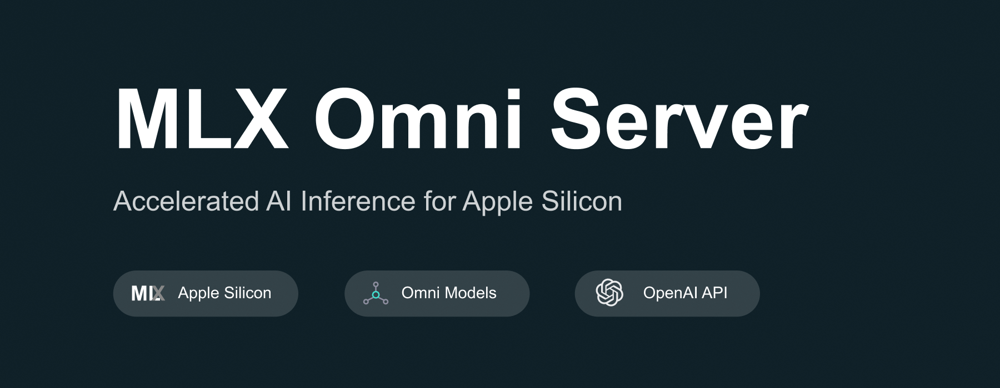

# MLX Omni Server



MLX Omni Server is a local inference server powered by Apple's MLX framework, specifically designed for Apple Silicon (M-series) chips. It implements
OpenAI-compatible API endpoints, enabling seamless integration with existing OpenAI SDK clients while leveraging the power of local ML inference.

## Features

- 🚀 **Apple Silicon Optimized**: Built on MLX framework, optimized for M1/M2/M3/M4 series chips
- 🔌 **OpenAI API Compatible**: Drop-in replacement for OpenAI API endpoints
- 🎯 **Multiple AI Capabilities**:
    - Audio Processing (TTS & STT)
    - Chat Completion
    - Image Generation
- ⚡ **High Performance**: Local inference with hardware acceleration
- 🔐 **Privacy-First**: All processing happens locally on your machine
- 🛠 **SDK Support**: Works with official OpenAI SDK and other compatible clients

## Supported API Endpoints

The server implements OpenAI-compatible endpoints:

- [Chat completions](https://platform.openai.com/docs/api-reference/chat): `/v1/chat/completions`
    - ✅ Chat
    - ✅ Tools, Function Calling
    - ✅ LogProbs
    - 🚧 Vision
- [Audio](https://platform.openai.com/docs/api-reference/audio)
    - ✅ `/v1/audio/speech` - Text-to-Speech
    - ✅ `/v1/audio/transcriptions` - Speech-to-Text
- [Models](https://platform.openai.com/docs/api-reference/models/list)
    - ✅ `/v1/models` - List models
    - ✅ `/v1/models/{model}` - Retrieve or Delete model
- [Images](https://platform.openai.com/docs/api-reference/images)
    - ✅ `/v1/images/generations` - Image generation

## Installation

```bash
# Install using pip
pip install mlx-omni-server
```

## Quick Start

1. Start the server:

```bash
# If installed via pip as a package
mlx-omni-server
```

you can use `--port` to specify a different port,such as: `mlx-omni-server --port 10240`, default port is 10240.

You can view more startup parameters by using `mlx-omni-server --help`.


2. Use with OpenAI SDK:

```python
from openai import OpenAI

# Configure client to use local server
client = OpenAI(
    base_url="http://localhost:10240/v1",  # Point to local server
    api_key="not-needed"  # API key is not required for local server
)

# Text-to-Speech Example
response = client.audio.speech.create(
    model="lucasnewman/f5-tts-mlx",
    input="Hello, welcome to MLX Omni Server!"
)

# Speech-to-Text Example
audio_file = open("speech.mp3", "rb")
transcript = client.audio.transcriptions.create(
    model="mlx-community/whisper-large-v3-turbo",
    file=audio_file
)

# Chat Completion Example
chat_completion = client.chat.completions.create(
    model="meta-llama/Llama-3.2-3B-Instruct",
    messages=[
        {"role": "user", "content": "What can you do?"}
    ]
)

# Image Generation Example
image_response = client.images.generate(
    model="argmaxinc/mlx-FLUX.1-schnell",
    prompt="A serene landscape with mountains and a lake",
    n=1,
    size="512x512"
)
```

You can view more examples in [examples](examples).

## Contributing

Contributions are welcome! Please feel free to submit a Pull Request. For major changes, please open an issue first to discuss what you would like to
change.

## License

This project is licensed under the MIT License - see the [LICENSE](LICENSE) file for details.

## Acknowledgments

- Built with [MLX](https://github.com/ml-explore/mlx) by Apple
- API design inspired by [OpenAI](https://openai.com)
- Uses [FastAPI](https://fastapi.tiangolo.com/) for the server implementation
- Chat(text generation) by [mlx-lm](https://github.com/ml-explore/mlx-examples/tree/main/llms/mlx_lm)
- Image generation by [diffusionkit](https://github.com/argmaxinc/DiffusionKit)
- Text-to-Speech by [lucasnewman/f5-tts-mlx](https://github.com/lucasnewman/f5-tts-mlx)
- Speech-to-Text by [mlx-whisper](https://github.com/ml-explore/mlx-examples/blob/main/whisper/README.md)

## Disclaimer

This project is not affiliated with or endorsed by OpenAI or Apple. It's an independent implementation that provides OpenAI-compatible APIs using
Apple's MLX framework.

## Star History 🌟

[](https://star-history.com/#madroidmaq/mlx-omni-server&Date)
