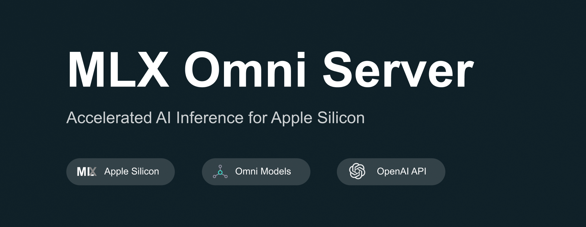

# MLX Omni Server

[](https://pypi.python.org/pypi/mlx-omni-server)
[](https://deepwiki.com/zhutao100/mlx-omni-server)
[](LICENSE)
[](https://python.org)
[](https://developer.apple.com/macos/)



**MLX Omni Server** is a high-performance local inference server built on Apple's MLX framework, optimized for Apple Silicon (M-series) chips. It provides OpenAI-compatible API endpoints, enabling seamless integration with existing OpenAI SDK clients while delivering fast, private AI processing directly on your Mac.

## Fork vs Original Project

This repository is a fork of the [original MLX Omni Server](https://github.com/madroidmaq/mlx-omni-server) project with significant enhancements and modifications.

### Key Enhancements in This Fork

- **Vision/Multimodal Support**: Added comprehensive Vision-Language Model (VLM) support through mlx_vlm integration for image processing capabilities.
- **Responses API Endpoint**: Added support for OpenAI's Responses API (`/v1/responses`) as an alternative to chat completions with enhanced structured output capabilities, improved tool calling workflows, and better streaming event handling.
- **Advanced Tool Parsing**: Enhanced tool calling support for Qwen3 and GLM4 model families with sophisticated parsing logic including heuristic detection and malformed recovery mechanisms.
- **Intelligent Caching**: Reworked prompt cache and chat completion cache systems with improved caching efficiency and memory management.
- **Performance Improvements**: Enhanced streaming generation with better buffering and client disconnection handling.

### Differences from Original

The original project provided dual API compatibility with both OpenAI and Anthropic APIs, while this fork focuses exclusively on OpenAI-compatible endpoints but with enhanced features and performance optimizations.

For details on the original project, please refer to the [upstream repository](https://github.com/madroidmaq/mlx-omni-server).

## Features

- **Apple Silicon Optimized**: Built on MLX framework, specifically tuned for M1/M2/M3/M4 chips.
- **OpenAI API Compatible**: Drop-in replacement for OpenAI API endpoints.
- **Comprehensive AI Capabilities**:
  - **Chat & Text Generation**: Multi-turn conversations, streaming responses, function calling.
  - **Audio Processing**: Text-to-Speech (TTS) and Speech-to-Text (STT) support.
  - **Image Generation**: High-quality image creation with FLUX models.
  - **Embeddings**: Text vectorization for semantic search and similarity.
- **High Performance**: Local inference with hardware acceleration.
- **Privacy-First**: All processing happens locally on your machine.
- **Developer Friendly**: Works with official OpenAI SDK and other compatible clients.
- **Easy Installation**: Simple pip install with minimal dependencies.

## Supported API Endpoints

The server implements OpenAI-compatible endpoints:

- **Chat completions**: `/v1/chat/completions`
- **Responses**: `/v1/responses`
  - Chat
  - Tools, Function Calling
  - Structured Output
  - LogProbs
  - Vision
- **Audio**
  - `/v1/audio/speech` - Text-to-Speech
  - `/v1/audio/transcriptions` - Speech-to-Text
- **Models**
  - `/v1/models` - List models
  - `/v1/models/{model}` - Retrieve model info
- **Images**
  - `/v1/images/generations` - Image generation
- **Embeddings**
  - `/v1/embeddings` - Create embeddings for text

For detailed API documentation and examples, please see the [API documentation](docs/apis).

## Quick Start

### Prerequisites

- macOS with Apple Silicon (M1/M2/M3/M4 chip)
- Python 3.11 or higher
- Internet connection for initial model downloads

### Installation

```bash
git clone https://github.com/zhutao100/mlx-omni-server.git
cd mlx-omni-server
pip install .
```

### Start the Server

```bash
mlx-omni-server
```

The server starts on `http://localhost:10240` by default.

### Python Client Example

```python
from openai import OpenAI

# Connect to local server
client = OpenAI(
    base_url="http://localhost:10240/v1",
    api_key="not-needed"
)

# Simple chat request
response = client.chat.completions.create(
    model="mlx-community/gemma-3-1b-it-4bit-DWQ",
    messages=[{"role": "user", "content": "Hello! How are you?"}]
)
print(response.choices[0].message.content)
```

### Server Configuration

```bash
# Custom port
mlx-omni-server --port 8000

# Specific host and port
mlx-omni-server --host 127.0.0.1 --port 8000

# View all options
mlx-omni-server --help
```

| Option | Default | Description |
|--------|---------|-------------|
| `--host` | `0.0.0.0` | Host to bind the server to |
| `--port` | `10240` | Port to bind the server to |
| `--workers` | `1` | Number of worker processes |
| `--log-level` | `info` | Logging level (debug, info, warning, error, critical) |
| `--log-file` | `false` | Enable on-disk logging |
| `--log-dir` | `~/Library/Logs/mlx-omni-server` | Directory for on-disk logs (used with `--log-file`) |
| `--log-file-format` | `jsonl` | On-disk log format: `text` or `jsonl` (used with `--log-file`) |

## Documentation

- [API Reference](docs/apis)
- [Supported Models](docs/supported_models.md)
- [Development Guide](docs/development_guide.md)

## License

This project is licensed under the MIT License - see the [LICENSE](LICENSE) file for details.

## Acknowledgments

This project is a fork of [MLX Omni Server by madroidmaq](https://github.com/madroidmaq/mlx-omni-server). We acknowledge and appreciate the original work that laid the foundation for this enhanced version.

Core Frameworks:
- Built with [MLX](https://github.com/ml-explore/mlx) by Apple
- API design inspired by [OpenAI](https://openai.com)
- Server implementation with [FastAPI](https://github.com/fastapi/fastapi)

## Disclaimer

This project is not affiliated with or endorsed by OpenAI or Apple. It's an independent implementation providing OpenAI-compatible APIs using Apple's MLX framework.
